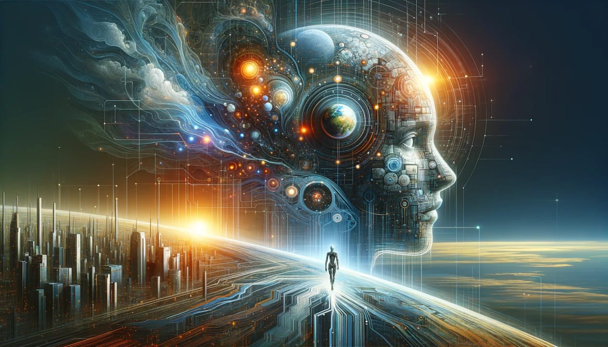

# Awesome Unified Understanding and Generation  <!-- omit in toc -->

  

This is a repository for organizing unified understanding and generation works.
We have organized the existing works in terms of paradigms. Specifically, some works focus on the research of unified tokenizers. For worksfocusing on unified model and framework, we classified them according to text generation methods and image generation methods. For example, "AR + Masked AR" means that the text uses the AR method, while image tokens adopt the Masked AR (discrete diffusion) method. Methods belong to "AR + Masked AR + Additional Diffusion (Two Model)" additionally use a diffusion network to decode image tokens on the basis mentioned above. Furthermore, "Seperate Understanding and Generation Transformers" indicates that the model decouples understanding and generation into two transformers. When performing image generation, the understanding transformer serves to encode semantic-rich query embeddings as conditions for generation.

If you have any suggestions, please feel free to open issues or contact us.

#### :star: If you find this repo useful, please star it!

### Unified Tokenizer
  + [UniTok: A Unified Tokenizer for Visual Generation and Understanding](https://arxiv.org/abs/2502.20321) (Feb. 2025, arXiv)
  
  

  + [UniToken: Harmonizing Multimodal Understanding and Generation through Unified Visual Encoding](https://arxiv.org/pdf/2504.04423v1) (Apr. 2025, arXiv)
  
  

    + [TokenFlow: Unified Image Tokenizer for Multimodal Understanding and Generation](https://arxiv.org/abs/2412.03069) (Dec. 2024, arXiv)
  
  

  + [MUSE-VL: Modeling Unified VLM through Semantic Discrete Encoding](https://www.arxiv.org/abs/2411.17762) (Nov. 2024, arXiv)
  

  + [Making LLaMA SEE and Draw with SEED Tokenizer](https://arxiv.org/abs/2310.01218) (Oct. 2023, ICLR)
  
  

  + [SEED-X: Multimodal Models with Unified Multi-granularity Comprehension and Generation](https://arxiv.org/abs/2404.14396) (Apr. 2024, arXiv)
  
  

  + [LaVIT: Unified Language-Vision Pretraining in LLM with Dynamic Discrete Visual Tokenization](https://arxiv.org/abs/2309.04669) (Sep. 2023, ICLR)
  
  

  + [Planting a SEED of Vision in Large Language Model](https://arxiv.org/abs/2307.08041) (Jul. 2023, arXiv)
  
  

### AR + AR (One Model)

  + [UGen: Unified Autoregressive Multimodal Model with Progressive Vocabulary Learning](https://arxiv.org/pdf/2503.21193v1) (Mar. 2025, arXiv)
  

  + [OmniMamba: Efficient and Unified Multimodal Understanding and Generation via State Space Models](https://arxiv.org/abs/2503.08686) (Mar. 2025, arXiv)
  

  + [Liquid: Language Models are Scalable Multi-modal Generators](https://arxiv.org/abs/2412.04332) (Dec. 2024, arXiv)
  

  + [SynerGen-VL: Towards Synergistic Image Understanding and Generation with Vision    Experts and Token Folding](https://arxiv.org/abs/2412.09604) (Dec. 2024, arXiv)
  

  + [Janus: Decoupling Visual Encoding for Unified Multimodal Understanding and Generation](https://arxiv.org/abs/2410.13848) (Nov. 2024, arXiv)
  
  

  + [JetFormer: An Autoregressive Generative Model of Raw Images and Text](https://arxiv.org/abs/2411.19722) (Nov. 2024, arXiv)
  

  + [Emu3: Next-Token Prediction is All You Need](https://arxiv.org/abs/2409.18869) (Sep. 2024, arXiv)
  
  

  + [ANOLE: An Open, Autoregressive, Native Large Multimodal Models for Interleaved Image-Text Generation](https://arxiv.org/abs/2407.06135) (Jul. 2024, arXiv)
  
  

  + [Chameleon: Mixed-Modal Early-Fusion Foundation Models](https://arxiv.org/abs/2405.09818) (May 2024, arXiv)
  
  

  + [World Model on Million-Length Video And Language With Blockwise RingAttention](https://arxiv.org/abs/2402.08268) (Feb. 2024, arXiv)
  
  

  + [AnyGPT: Unified Multimodal LLM with Discrete Sequence Modeling](https://arxiv.org/abs/2402.12226) (Feb. 2024, arXiv)
  
  

  + [Video-LaVIT: Unified Video-Language Pre-training with Decoupled Visual-Motional Tokenization](https://arxiv.org/abs/2402.03161) (Feb. 2024, arXiv)
  
  

  

### AR + AR + Additional Diffusion (Two Model)

  + [ILLUME+: Illuminating Unified MLLM with Dual Visual Tokenization and Diffusion Refinement](https://arxiv.org/pdf/2504.01934v1) (Apr. 2025, arXiv)
  
  

  + [MIO: A Foundation Model on Multimodal Tokens](https://arxiv.org/abs/2409.17692) (Sep. 2024, arXiv)
  

  + [Orthus: Autoregressive Interleaved Image-Text Generation with Modality-Specific Heads](https://arxiv.org/abs/2412.00127) (Nov. 2024, arXiv)
  
  

  
  + [PUMA: Empowering Unified MLLM with Multi-granular Visual Generation](https://arxiv.org/abs/2410.13848) (Oct. 2024, arXiv)
  
  

  + [VILA-U: a Unified Foundation Model Integrating Visual Understanding and Generation](https://arxiv.org/abs/2409.04429) (Sep. 2024, arXiv)
  

  + [X-VILA: Cross-Modality Alignment for Large Language Model](https://arxiv.org/abs/2405.19335) (May. 2024, arXiv)
  

  + [Unified-IO 2: Scaling Autoregressive Multimodal Models with Vision, Language, Audio, and Action](https://arxiv.org/abs/2312.17172) (Dec. 2023, arXiv)
  
  

  + [VL-GPT: A Generative Pre-trained Transformer for Vision and Language Understanding and Generation](https://arxiv.org/abs/2312.09251) (Dec. 2023, arXiv)
  
  

  + [NExT-GPT: Any-to-Any Multimodal LLM](https://arxiv.org/abs/2309.05519) (Sep. 2023, ICML)
  
  

  + [Emu2: Generative Multimodal Models are In-Context Learners](https://arxiv.org/abs/2312.13286) (Jul. 2023, CVPR)
  
  

  + [Emu: Generative Pretraining in Multimodality](https://arxiv.org/abs/2307.05222) (Jul. 2023, ICLR)
  
  
  

### AR + Masked AR (One Model)

  + [UniGen: Enhanced Training & Test-Time Strategies for Unified Multimodal Understanding and Generation](https://arxiv.org/pdf/2505.14682v1) (May. 2025, arXiv)
  
  
  + [Show-o: One Single Transformer to Unify Multimodal Understanding and Generation](https://arxiv.org/abs/2408.12528) (Aug. 2024, arXiv)
  
  

  + [Harmonizing Visual Representations for Unified Multimodal Understanding and Generation](https://arxiv.org/pdf/2503.21979v1) (Mar. 2025, arXiv)
  
  

### AR + Masked AR + Additional Diffusion (Two Model)

  + [MMAR: Towards Lossless Multi-Modal Auto-Regressive Probabilistic Modeling](https://arxiv.org/abs/2410.10798) (Oct. 2024, arXiv)
  

### AR + Full Attention + Additional Diffusion (Two Model)

  + [Show-o2: Improved Native Unified Multimodal Models](https://arxiv.org/abs/2506.15564) (May. 2025, arXiv)
  
  

  + [LlamaFusion: Adapting Pretrained Language Models for Multimodal Generation](https://arxiv.org/abs/2412.15188) (Dec. 2024, arXiv)
  

### AR + Continuous Diffusion (One Model)

  + [Emerging Properties in Unified Multimodal Pretraining](https://arxiv.org/abs/2505.14683) (May. 2025, arXiv)
  
  

  + [MINT: Multi-modal Chain of Thought in Unified Generative Models for Enhanced Image Generation](https://arxiv.org/pdf/2503.01298) (Mar. 2025, arXiv)
  

  + [JanusFlow: Harmonizing Autoregression and Rectified Flow for Unified Multimodal Understanding and Generation](https://arxiv.org/abs/2411.07975) (Nov. 2024, arXiv)
  
  

  + [OmniGen: Unified Image Generation](https://arxiv.org/pdf/2409.11340) (Sep. 2024, arXiv)
  
  

  + [MonoFormer: One Transformer for Both Diffusion and Autoregression](https://arxiv.org/abs/2409.16280) (Sep. 2024, arXiv)
  
  

  + [Transfusion: Predict the Next Token and Diffuse Images with One Multi-Modal Model](https://www.arxiv.org/abs/2408.11039) (Aug. 2024, arXiv)
  

  

### Diffusion
  + [Mmada: Multimodal large diffusion language models](https://arxiv.org/abs/2505.15809) (May. 2025, arXiv)
  
  

  + [MMGen: Unified Multi-modal Image Generation and Understanding in One Go](https://arxiv.org/pdf/2503.20644v1) (Mar. 2025, arXiv)
  
  
  
  + [Dual Diffusion for Unified Image Generation and Understanding](https://www.arxiv.org/abs/2501.00289) (Jan. 2025, arXiv)
  

  + [OmniFlow: Any-to-Any Generation with Multi-Modal Rectified Flows](https://arxiv.org/abs/2412.01169) (Dec. 2024, arXiv)
  

  + [CoDi: Any-to-Any Generation via Composable Diffusion](https://arxiv.org/abs/2305.11846) (May. 2023, NeurIPS)
  
  

### Seperate Understanding and Generation Transformers (Two Model)
  + [OmniGen2: Exploration to Advanced Multimodal Generationn](https://arxiv.org/pdf/2506.18871) (June. 2025, arXiv)
  
  

  + [Ming-Lite-Uni: Advancements in Unified Architecture for Natural Multimodal Interaction](https://arxiv.org/pdf/2505.02471v1) (May. 2025, arXiv)
  
  

  + [BLIP3-o: A Family of Fully Open Unified Multimodal Models—Architecture, Training and Dataset](https://arxiv.org/pdf/2505.09568v1) (May. 2025, arXiv)
  
  

  + [Transfer between Modalities with MetaQueries](https://arxiv.org/abs/2504.06256) (Apr. 2025, arXiv)
  

  + [Nexus-Gen: A Unified Model for Image Understanding, Generation, and Editing](https://arxiv.org/pdf/2504.21356v1) (Apr. 2025, arXiv)
  

  + [MetaMorph: Multimodal Understanding and Generation via Instruction Tuning](https://arxiv.org/abs/2412.14164v1) (Dec. 2024, arXiv)
  

  + [MM-Interleaved: Interleaved Image-Text Generative Modeling via Multi-modal Feature Synchronizer](https://arxiv.org/abs/2401.10208) (Jan. 2024, arXiv)
  
  

  + [DreamLLM: Synergistic Multimodal Comprehension and Creation](https://arxiv.org/abs/2309.11499) (Dec. 2023, ICLR)
  
  

## Acknowledgements

This template is provided by [Awesome-Unified-Multimodal-Models](https://github.com/showlab/Awesome-Unified-Multimodal-Models).
